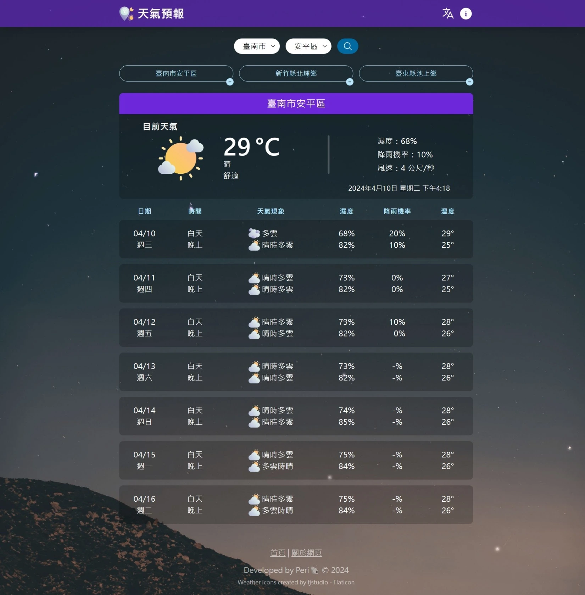

# 天氣預報

天氣預報 App 網頁提供台灣各城市和鄉鎮的即時天氣資訊及一週天氣預報，資訊皆來自中央氣象署的[氣象資料開放平臺](https://opendata.cwa.gov.tw/index)。憑藉直觀的界面和實時更新，使用者可以隨時了解所在地區的最新天氣狀況，也能儲存自訂地區以便日後快速查看。

## 功能

- 下拉式選單供使用者快速選取地區。
- 本地自動儲存地區紀錄，可以讀取上次查詢的地區，新增、刪除地區紀錄，點擊地區紀錄即可查看最新天氣資訊。
- 提供按鈕切換中文、English 語言介面。
- 響應式網頁設計(RWD)。
- 漸進式網路應用程式(PWA)。
- 即時氣象因子: 包含天氣現象、平均溫度、舒適度指數、每 6 小時降雨機率、相對濕度、風速等天氣資訊。
- 一週天氣預報因子: 包含天氣現象、相對濕度、每 12 小時降雨機率、平均溫度等天氣資訊。

## Demo

Live Demo: [天氣預報](https://periondev.github.io/vue-weather/)

## 參考文件

- [中央氣象署開放資料平臺之資料擷取 API
  ](https://opendata.cwa.gov.tw/dist/opendata-swagger.html)
- [氣象產品目錄總集](https://www.cwa.gov.tw/V8/C/D/Data_catalog_Detail.html?cls=1&pubtype_02=0)
- [中央氣象署產品說明文件
  預報-精緻化天氣預報-一週天氣預報](https://www.cwa.gov.tw/Data/data_catalog/1-1-5.pdf)
- [預報因子中英文對照及天氣描述代碼對應文件](https://opendata.cwa.gov.tw/opendatadoc/MFC/A0012-001.pdf)

## Tech Stack

This is a Vue 3 project bootstrapped with [create-vue](https://github.com/vuejs/create-vue) based on [Vite](https://v3.vitejs.dev/).

- Language: TypeScript
- Framework: Vue.js (Vue 3)
- Styling: Tailwind CSS
- Internationalization: Vue I18n
- Deployment: GitHub Pages & GitHub Actions
